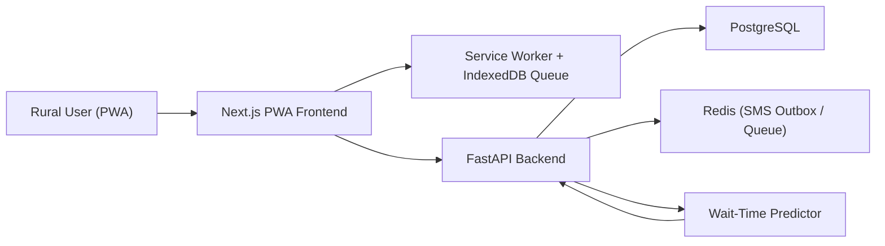

# SevaCare Rural (Web App MVP)

Ultra-lightweight rural healthcare booking platform with offline-first appointment flow.

## Stack
- Frontend: Next.js 16, Tailwind CSS 4, Zustand, IndexedDB (`idb`)
- Backend: FastAPI, SQLAlchemy
- Data: PostgreSQL
- Cache/queue: Redis
- AI wait-time module: Python heuristic baseline (LightGBM-ready interface)

## Architecture

## Features Implemented (MVP)
- Language selection (EN, HI, KN, TA, TE, BN, MR)
- OTP login flow (SMS mocked via Redis outbox queue)
- Nearby clinics list by geolocation
- Clinic details + wait-time prediction page
- Appointment booking with offline queue + auto-sync on reconnect
- Sync status screen for pending requests
- PWA manifest + service worker + offline fallback page

## Project Structure
- `frontend/` Next.js PWA
- `backend/` FastAPI API and models

## Local Setup
1. Backend:
   - `cd backend`
   - `python -m venv .venv`
   - `.venv\Scripts\activate` (Windows)
   - `pip install -r requirements.txt`
   - `uvicorn app.main:app --reload --port 8000`
2. Frontend:
   - `cd frontend`
   - `npm install`
   - `npm run dev`
3. Open:
   - App: `http://localhost:3000`
   - API docs: `http://localhost:8000/docs`

For local development with the mock SMS provider, the OTP response includes `dev_otp`. The backend also accepts `123456` as a fixed development OTP.

## API Endpoints
- Auth:
  - `POST /auth/send-otp`
  - `POST /auth/verify-otp`
- Clinics:
  - `GET /clinics/nearby?lat=&lng=&radius_km=`
  - `GET /clinics/{id}`
- Appointments:
  - `POST /appointments/book`
  - `GET /appointments/status?appointment_id=`
- Predictions:
  - `GET /predictions/wait-time?clinic_id=`

## Environment Variables
- Frontend: `frontend/.env.example`
- Backend: `backend/.env.example`

## Deployment
- Frontend (Vercel): `frontend/vercel.json`
- Backend (Railway/Render/Fly): `backend/Procfile`
